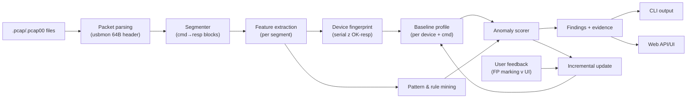

---

name: USB Anomaly Learning Tool overview: > Rozšíření stávajícího USB analyzátoru o pipeline pro hloubkovou analýzu komunikace TESTER↔device: detekce anomálií bez labelů, návrhy pravidel z dat a průběžné učení baseline z historických streamů (.pcap/.pcap00). Protokol je textový (ASCII command/response přes USB bulk), device fingerprint je serial extrahovaný přímo z OK-odpovědí. todos:

- id: config content: Vytvořit centrální konfigurační modul (thresholdy, parametry, cesty) status: pending
- id: analysis-core content: Implementovat segmenter (command→response hranice) a feature extraction status: pending
- id: unsupervised-baseline content: Implementovat baseline profil a anomaly scoring bez labelů status: pending
- id: rule-mining content: Přidat generátor návrhů pravidel z opakovaných odchylek status: pending
- id: cli-web-integration content: Integrovat deep analýzu do CLI a web API/UI s evidence výstupy status: pending
- id: model-persistence content: Přidat ukládání/načítání baseline profilu a inkrementální update status: pending
- id: validation-tests content: Doplnit testy včetně generátoru syntetických PCAP dat status: pending isProject: false

---

# Plán: Učenlivý nástroj pro hloubkovou analýzu USB komunikace

## Cíl

Vybudovat datově řízený systém, který z USB streamů (`.pcap`, `.pcap00`) automaticky:

- odhalí nestandardní chování (anomaly score + podezřelé úseky),
- navrhne pravidla z reálných dat (error patterny, špatné odpovědi, timeout-like sekvence),
- průběžně zlepšuje baseline bez nutnosti pevné specifikace protokolu.

---

## Výchozí stav projektu

Stávající aplikace umí:

- číst Linux USB mmap PCAP a zobrazit stream text,
- převádět pakety na řádky host/device,
- zobrazovat data ve web UI i přes CLI.

Klíčové soubory:

- `src/usb_analysis/pipeline.py` — parser a packet pipeline
- `src/usb_analysis/stream_text.py` — textový stream extractor
- `src/usb_analysis/web/app.py` + `web/static/app.js` — web API/UI
- `src/usb_analysis/cli.py` — CLI

---

## Poznatky z analýzy reálného souboru (`trezor.pcap00`)

Analýza vzorového souboru odhalila konkrétní strukturu komunikace, která přímo ovlivňuje návrh segmenteru, feature engineeringu i baseline modelu.

### Formát souboru a přenosy

- Formát: standard PCAP, magic `0xA1B2C3D4`, LinkType 220 (LINKTYPE_USB_LINUX_MMAPPED), usbmon binární hlavička 64 bajtů.
- Jedno zařízení: bus 1, dev 3 (Trezor, VID=0x1209 / PID=0x53C1).
- Tři typy přenosů:
  - **EP0 control** — USB enumerace a konfigurace (ignorovat v analýze).
  - **EP1 bulk** — hlavní příkazová komunikace (OUT = příkazy, IN = odpovědi).
  - **EP1+EP2 interrupt** — HID heartbeat polling ~8ms; payload nese device model signature `4c 57 33 64` ("LW3d") a monotónní čítač. Jde o jiný kanál než command/response — analyzovat odděleně.
- Status kódy: `0` = success, `-2` (ENOENT) = prázdný poll (normální u interrupt).

### Protokol je textový (ne binární)

Hlavní komunikace je čistě ASCII přes USB bulk:

```
HOST → DEVICE (bulk OUT, Submit event):
  checked-optiga-lock-check 5E708F42\r\n
  checked-otp-device-sn-write 47304272600L00 --execute 014BD9B1\r\n

DEVICE → HOST (bulk IN, Complete event):
  OK NO E0409FD3\r\n
  # The Tropic pairing process was not initiated. 56BA220C\r\n
  OK D736D92D\r\n
  ERROR invalid-crc "CRC suffix missing"\r\n

```

**Důležité:** Pro OUT přenosy jsou data v **Submit (S) eventu**, ne v Complete (C). Pro IN přenosy jsou data v **Complete (C) eventu**. Parser musí toto respektovat.

### Struktura příkazů a odpovědí

**Příkazy** (host → device):

- Formát: `<command-name> [args] <8-hex-CRC>\r\n`
- CRC je reálné pole — lze validovat.
- Prefix `checked-` označuje produkčně kritické příkazy se CRC ochranou.
- Slovník příkazů je fixní (~40 známých příkazů).

**Odpovědi** (device → host):


| Typ        | Příklad                                  | Sémantika                                      |
| ---------- | ---------------------------------------- | ---------------------------------------------- |
| `OK`       | `OK D736D92D`                            | Úspěch, often nese device serial               |
| `OK NO`    | `OK NO E0409FD3`                         | Úspěch, ale podmínka nesplněna (chip nezamčen) |
| `ERROR`    | `ERROR invalid-crc "CRC suffix missing"` | Chyba s důvodem                                |
| `# <text>` | `# Testing SPI communication...`         | Progress/info řádek                            |
| hex dump   | `Bytes written: 3437...`                 | Data výstup read příkazů                       |


Jedna odpověď může být víceřádková: `[# progress]* → OK|ERROR`.

### Device fingerprint

Serial zařízení (`D736D92D`) je přítomný přímo v `OK`-odpovědích. Extrakce: regex `OK(?:\s+NO)?\s+([0-9A-F]{8})` na finální řádek segmentu. Toto je přirozený klíč pro per-device baseline — žádný speciální fingerprint modul není potřeba.

### Přirozené hranice segmentů

Konec segmentu = první řádek začínající `OK` nebo `ERROR` po příkazu. Progress řádky (`#`) jsou součástí segmentu, ne samostatné entity. Timeout jako hranice **není potřeba** — protokol má explicitní terminátory.

Vyšší úroveň: **test run** = celá sekvence ~40 segmentů od `ping` po finální `checked-`*. Soubor obsahuje přesně **70 opakování** identické sekvence (každý příkaz se v souboru vyskytuje 70×).

### Klíčové anomálie v datech

- `ERROR invalid-crc "CRC suffix missing"` na příkazu `crc-enable` je **očekávané chování** — `crc-enable` se volá bez CRC (CRC ještě není zapnuté). Baseline musí toto označit jako normální, ne jako anomálii.
- `OK NO` pro `checked-optiga-lock-check` / `checked-tropic-lock-check` je normální pro nové (nezamčené) zařízení. Anomálií by bylo `OK NO` na těchto příkazech **po** předchozím úspěšném `checked-optiga-lock` v témže run. **Pořadí segmentů v rámci run je zásadní kontext.**
- Velké časové mezery (>1s) v heartbeat streamu jsou detekovatelné, ale jde o pauzy mezi test runy — ne o interní chyby.

---

## Architektura navrženého řešení




---

## Fáze implementace

### Fáze 0: Konfigurace (předpoklad všech ostatních)

**Nový soubor:** `src/usb_analysis/analysis/config.py`

Centrální místo pro všechny parametry — žádné magic numbers v kódu:

```python
@dataclass
class AnalysisConfig:
    # Segmentace
    segment_end_prefixes: list[str] = ("OK", "ERROR")
    progress_prefix: str = "#"
    line_encoding: str = "ascii"
    max_segment_lines: int = 50          # ochrana proti neuzavřeným segmentům

    # Baseline
    min_samples_for_ml: int = 20         # pod tímto prahem = rule-based fallback
    anomaly_score_threshold: float = 3.0 # z-score pro report

    # Persistence
    baseline_path: str = "~/.usb_analysis/baseline"
    baseline_schema_version: int = 1

    # Výkon
    stream_chunk_size: int = 65536       # bytes, pro velké soubory

```

### Fáze 1: Segmentace a feature extraction

**Nové soubory:**

- `src/usb_analysis/analysis/segmenter.py`
- `src/usb_analysis/analysis/features.py`

#### `segmenter.py` — přesná definice hranic

Segment je uzavřená jednotka: jeden příkaz + všechny response řádky až po `OK` nebo `ERROR`.

```
Algoritmus:
  Pro každý paket:
    - Bulk OUT Submit s payloadem → flush předchozí segment, začni nový
    - Bulk IN Complete s payloadem → akumuluj do bufferu
    - Z bufferu extrahuj kompletní \r\n-ukončené řádky
    - Pokud řádek začíná OK nebo ERROR → uzavři segment
    - Řádky s # → progress_lines segmentu
  Pozor: velké payloady (certifikáty ~2KB) jsou normální → buffer nesmí mít
  pevný limit.
  Multi-file sekvence (.pcap00, .pcap01...): soubory jsou fragmenty jednoho
  streamu → konkatenovat jako jeden virtuální stream (sdílený buffer).

```

**Datový model segmentu:**

```python
@dataclass
class Segment:
    run_index: int           # pořadí příkazu v rámci test run
    cmd_raw: str             # celý příkaz včetně CRC a args
    cmd_name: str            # první slovo
    cmd_args: list[str]      # prostřední tokeny
    cmd_crc: str | None      # poslední 8-hex token (pokud přítomen)
    progress_lines: list[str]
    final_response: str      # řádek s OK/ERROR
    outcome: Literal["OK", "OK_NO", "ERROR", "TIMEOUT", "UNKNOWN"]
    device_serial: str | None  # extrahovaný z OK-odpovědi
    ts_cmd: float            # timestamp příkazu (Unix)
    ts_resp: float           # timestamp finální odpovědi
    latency_ms: float
    payload_bytes_out: int
    payload_bytes_in: int
    source_file: str

```

#### `features.py` — feature vektor pro baseline/scoring

```python
@dataclass
class SegmentFeatures:
    # Identita
    cmd_name: str
    device_serial: str | None

    # Outcome
    outcome: str              # OK / OK_NO / ERROR / UNKNOWN
    crc_present: bool         # příkaz obsahuje CRC suffix
    crc_valid: bool | None    # CRC sedí (pokud implementováno)

    # Timing
    latency_ms: float
    latency_z: float          # z-score vůči per-cmd baseline (po učení)

    # Velikost
    resp_line_count: int
    payload_out_bytes: int
    payload_in_bytes: int

    # Kontext
    run_position: int         # pořadí příkazu v test run
    prev_cmd_name: str | None # kontext předchozího příkazu
    run_outcome_so_far: str   # OK_only / has_errors / has_ok_no

```

**Normalizace:** Všechny numerické features normalizovat před distance scoring (min-max nebo z-score per feature). Různé řády (latence vs. počty) jinak pohltí vzdálenostní metriky.

### Fáze 2: Baseline profil a anomaly scoring

**Nové soubory:**

- `src/usb_analysis/analysis/baseline.py`
- `src/usb_analysis/analysis/scorer.py` *(dříve* `anomaly.py` *— přejmenováno)*

#### `baseline.py` — per-device, per-command profil

```python
@dataclass
class CommandProfile:
    cmd_name: str
    sample_count: int
    outcome_distribution: dict[str, int]   # {"OK": 65, "OK_NO": 5}
    latency_stats: dict                    # mean, std, median, mad
    resp_line_count_stats: dict
    payload_in_stats: dict
    known_progress_patterns: list[str]     # typické # řádky
    expected_at_positions: list[int]       # run_position kde se příkaz obvykle vyskytuje

@dataclass
class DeviceBaseline:
    schema_version: int
    device_serial: str
    created_at: str
    updated_at: str
    sample_count: int                      # počet run sekvencí
    commands: dict[str, CommandProfile]
    known_expected_outliers: list[str]     # např. "crc-enable→ERROR je normální"

```

**Klíčová pravidla pro** `known_expected_outliers`**:**

- `crc-enable → ERROR invalid-crc` = normální (vždy první příkaz bez CRC)
- `checked-*-lock-check → OK NO` = normální pro nezamčené zařízení před lock příkazem

**Fallback při malém počtu dat:** Pokud `sample_count < min_samples_for_ml`, místo statistického scoringu použít rule-based check (outcome != OK a není v known_expected_outliers → score = 1.0).

#### `scorer.py` — aplikace baseline na nová data

Skóre anomálie `[0.0 – 1.0]`:

- Outcome mimo `outcome_distribution` pro daný příkaz → +0.4
- Latence mimo `mean ± 3*MAD` → +0.3 (váha dle odchylky)
- `resp_line_count` mimo očekávaný rozsah → +0.2
- Příkaz na neobvyklé `run_position` → +0.1
- Kontextová anomálie (`OK NO` po předchozím lock příkazu) → +0.5 (override)

Výstup:

```python
@dataclass
class AnomalyFinding:
    segment: Segment
    score: float
    reasons: list[str]     # lidsky čitelné důvody
    evidence: dict         # raw hodnoty pro drill-down

```

### Fáze 3: Rule mining

**Nový soubor:** `src/usb_analysis/analysis/rules.py`

Automaticky generovat pravidla z opakujících se odchylek:


| Pattern             | Příklad pravidla                                                         |
| ------------------- | ------------------------------------------------------------------------ |
| Sekvenční závislost | `checked-optiga-lock → OK` musí předcházet konci run; pokud chybí → rule |
| Error kontext       | `ERROR invalid-crc` mimo `crc-enable` → rule s confidence                |
| Timing spike        | `checked-wpc-update` trvá >5s → rule "WPC update timeout"                |
| Missing response    | Příkaz bez finální `OK`/`ERROR` odpovědi → "incomplete segment" rule     |
| Retry storm         | Stejný příkaz >1× v rámci jednoho run → "retry detected"                 |


Výstupní formát:

```python
@dataclass
class RuleCandidate:
    rule_id: str
    description: str
    confidence: float      # 0–1, podíl run sekvencí kde platí
    support: int           # počet výskytů
    example_segments: list[Segment]  # max 3 příklady
    suggested_action: str  # "investigate" / "add_to_expected" / "alert"

```

### Fáze 4: CLI a Web API/UI integrace

**Upravené soubory:**

- `src/usb_analysis/cli.py`
- `src/usb_analysis/web/app.py`
- `src/usb_analysis/web/static/index.html` + `app.js`

#### CLI — nový příkaz

```bash
usb-analyze deep-analyze <path-or-dir> [--device <serial>] [--baseline <path>]

```

Výstup:

```
Device: D736D92D  |  Runs: 70  |  Segments: 13160
─────────────────────────────────────────────────
TOP ANOMALIES (score > 0.5):
  [0.90]  checked-tropic-lock-check → OK NO (run 14, position 11)
          Reason: OK_NO after successful lock in previous run
          Evidence: latency=45ms (baseline: 38±3ms), prev_lock=OK

RULE CANDIDATES:
  [conf=0.85]  "WPC update >2000ms" — 12× výskyt, příklad: run 3
  [conf=1.00]  "crc-enable→ERROR je normální" — 70× (known expected)

BASELINE: 70 runs, last updated 2024-01-15

```

#### Web API — nové endpointy


| Endpoint                     | Popis                                                |
| ---------------------------- | ---------------------------------------------------- |
| `GET /api/deep/summary`      | Přehled: počet runs, anomálií, pravidel              |
| `GET /api/deep/findings`     | Seznam `AnomalyFinding` (filtrovatelný, stránkovaný) |
| `GET /api/deep/rules`        | Rule candidates s evidence                           |
| `POST /api/deep/feedback`    | User feedback: označit finding jako FP/TP            |
| `GET /api/deep/segment/<id>` | Detail segmentu s kontextem                          |


#### UI — nové sekce

- Záložka **Anomálie**: seznam findings seřazených dle score, kliknutím drill-down na konkrétní řádky streamu.
- Záložka **Navržená pravidla**: rule candidates s confidence barem, tlačítko "Přidat do expected / Ignorovat".
- User feedback loop: označování FP přímo v UI → `POST /api/deep/feedback` → `IncrementalUpdate` → aktualizace baseline.

### Fáze 5: Persistence a inkrementální update

**Nový soubor:** `src/usb_analysis/analysis/store.py`

Baseline snapshot JSON schéma:

```json
{
  "schema_version": 1,
  "device_serial": "D736D92D",
  "created_at": "2024-01-10T08:00:00Z",
  "updated_at": "2024-01-15T14:22:00Z",
  "sample_count": 70,
  "frozen": false,
  "commands": {
    "checked-optiga-lock-check": {
      "sample_count": 70,
      "outcome_distribution": {"OK": 65, "OK_NO": 5},
      "latency_stats": {"mean": 38.2, "std": 3.1, "mad": 2.8}
    }
  },
  "known_expected_outliers": [
    "crc-enable→ERROR:invalid-crc"
  ]
}

```

Funkce `store.py`:

- `save_baseline(profile, path)` — versioned JSON
- `load_baseline(path)` — s kontrolou `schema_version`
- `merge_baseline(existing, new_segments)` — inkrementální update (Welfordův algoritmus pro streaming mean/variance)
- `freeze_baseline(path)` — nastavit `frozen=true` pro stabilní porovnání mezi firmware verzemi

### Fáze 6: Validace a testy

**Nové/upravené soubory:**

- `tests/test_segmenter.py`
- `tests/test_features.py`
- `tests/test_scorer.py`
- `tests/test_rules.py`
- `tests/fixtures/generate_synthetic_pcap.py`

#### Syntetický PCAP generátor

Protože reálné `.pcap00` soubory mohou být interní/proprietární, CI pipeline musí mít vlastní testovací data. Generátor vytvoří:

- normální test run sekvenci (all-OK),
- sekvenci s vloženou anomálií (`OK NO` po lock, ERROR mimo crc-enable),
- sekvenci s timing spikem.

#### Praktické metriky kvality (bez ground-truth)


| Metrika          | Definice                                                   |
| ---------------- | ---------------------------------------------------------- |
| Stability score  | Shoda anomálie listů mezi dvěma runy ze stejného souboru   |
| FP rate          | Podíl findings označených uživatelem jako FP               |
| Coverage         | Podíl known-bad patternů detekovaných v syntetickém vstupu |
| Rule convergence | Počet rule candidates klesá s přibývajícími daty           |


---

## Implementační roadmap


| Fáze      | Co                                                            | Výstup                            | Stav    |
| --------- | ------------------------------------------------------------- | --------------------------------- | ------- |
| **MVP 0** | `config.py` + `segmenter.py` + `features.py`                  | JSON feature dump z PCAP          | pending |
| **MVP 1** | `baseline.py` + `scorer.py` + CLI report                      | `deep-analyze` s anomaly reportem | pending |
| **v1.1**  | `rules.py` + `/api/deep/`* endpointy                          | Rule candidates + REST API        | pending |
| **v2**    | `store.py` (incremental) + UI drill-down + user feedback loop | Plně učenlivý systém              | pending |


---

## Rizika a mitigace (aktualizováno)


| Riziko                               | Mitigace                                                            |
| ------------------------------------ | ------------------------------------------------------------------- |
| Šum bez protokolové specifikace      | Hybridní přístup: statistika + heuristiky + known_expected_outliers |
| `crc-enable→ERROR` falešně pozitivní | Předdefinovat jako expected outlier v baseline                      |
| `OK NO` je kontextově závislé        | Scorer zohledňuje `run_outcome_so_far` a `prev_cmd_name`            |
| Různé device verze mění "normál"     | Baseline je per `device_serial` — jeden profil na serial            |
| Přeučení na malém datasetu           | Fallback rule-based mode pod `min_samples_for_ml`                   |
| Velké PCAP soubory (100MB+)          | Streaming parser s `stream_chunk_size`, nikdy nenačítat celý soubor |
| Proprietární testovací data v CI     | Syntetický PCAP generátor v `tests/fixtures/`                       |
| Drift baseline při FW upgradu        | `freeze_baseline()` před upgradem, nový profil po upgradu           |
| Magic numbers rozesété v kódu        | Vše v `config.py`, žádné hardcoded hodnoty                          |


